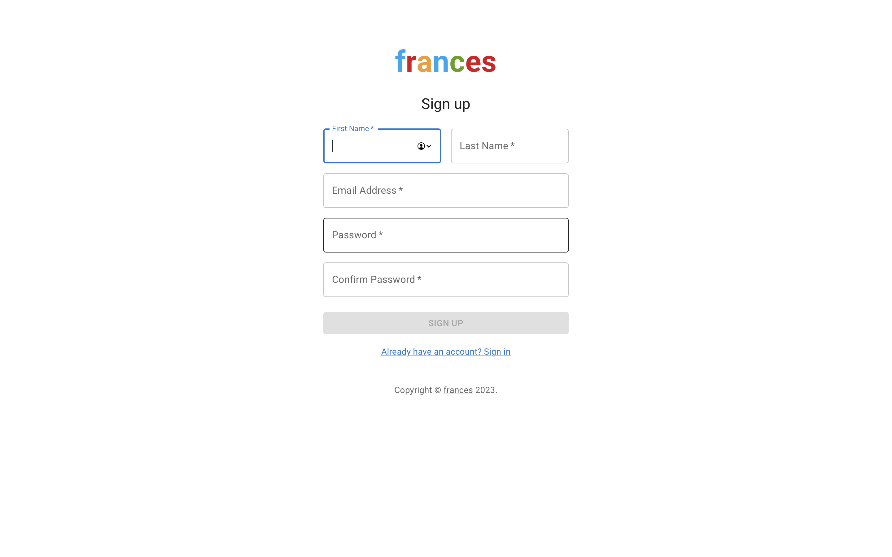
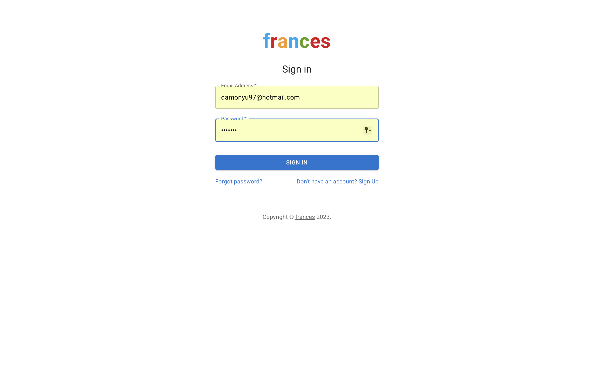
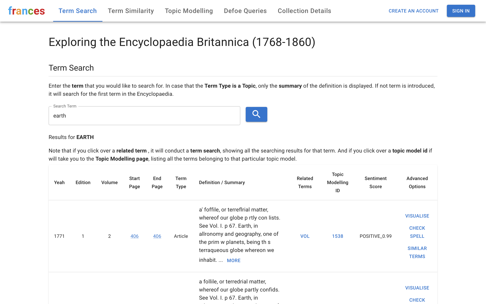
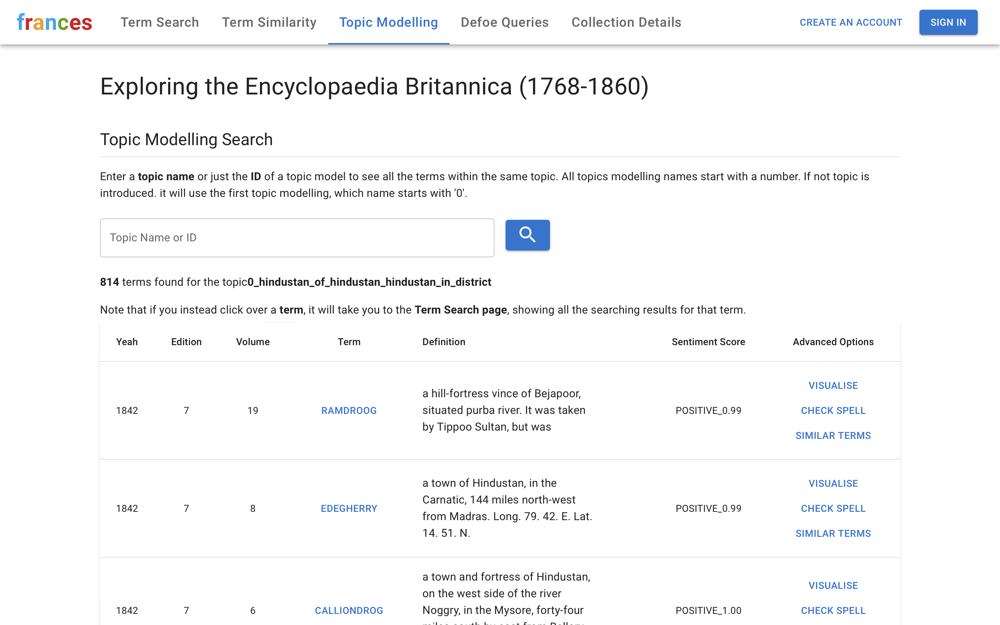
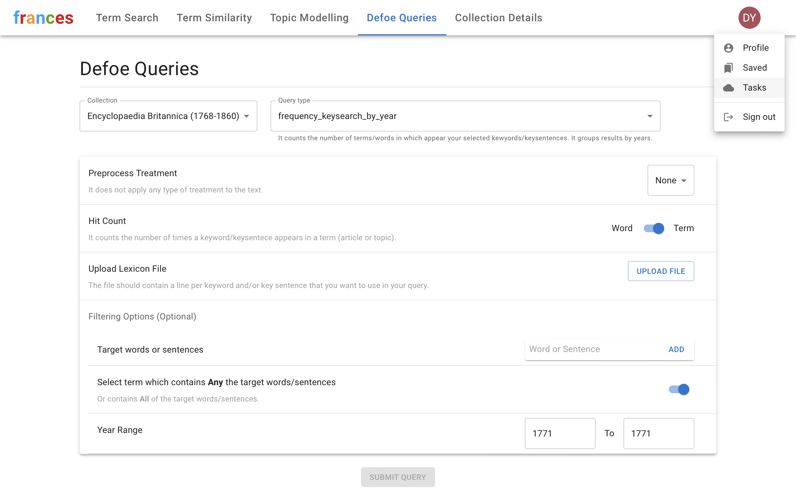
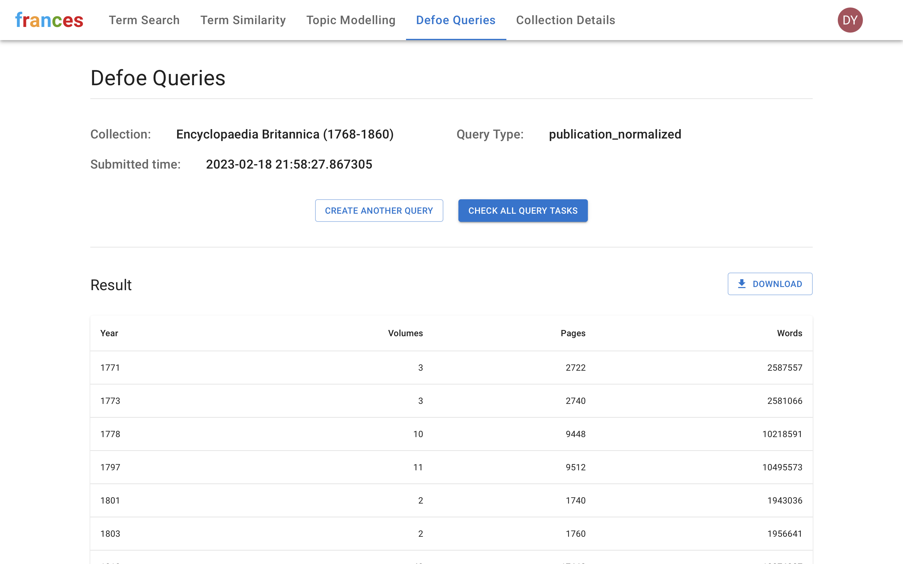
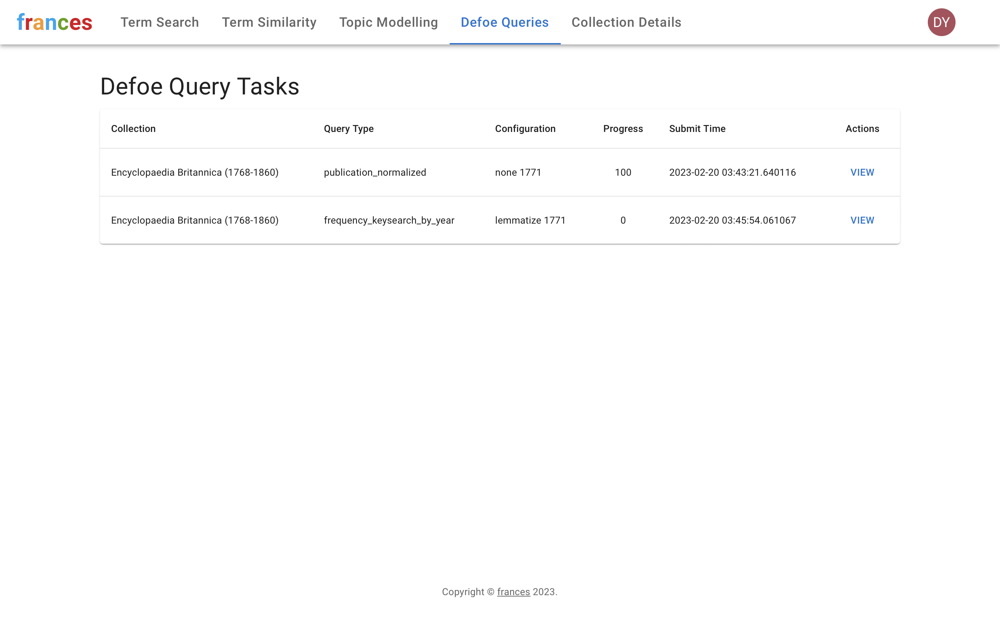
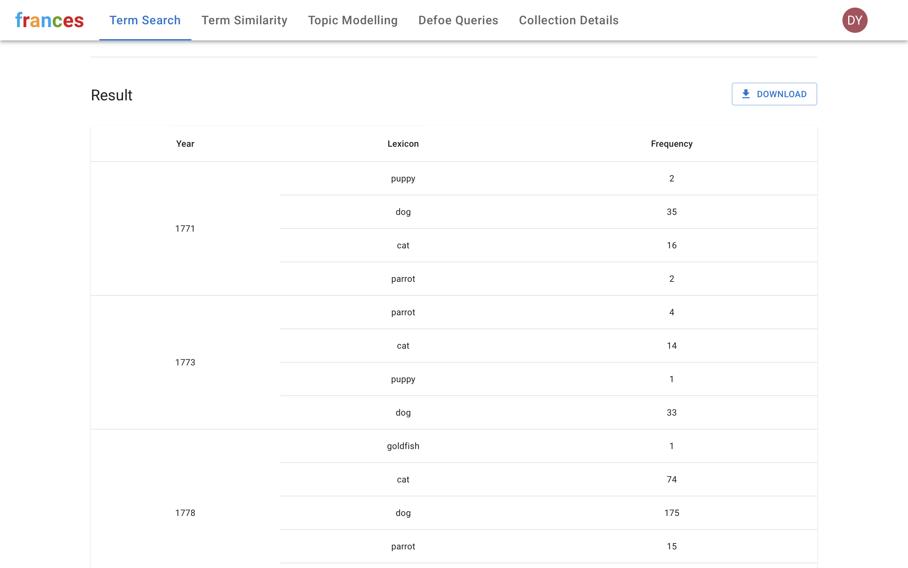
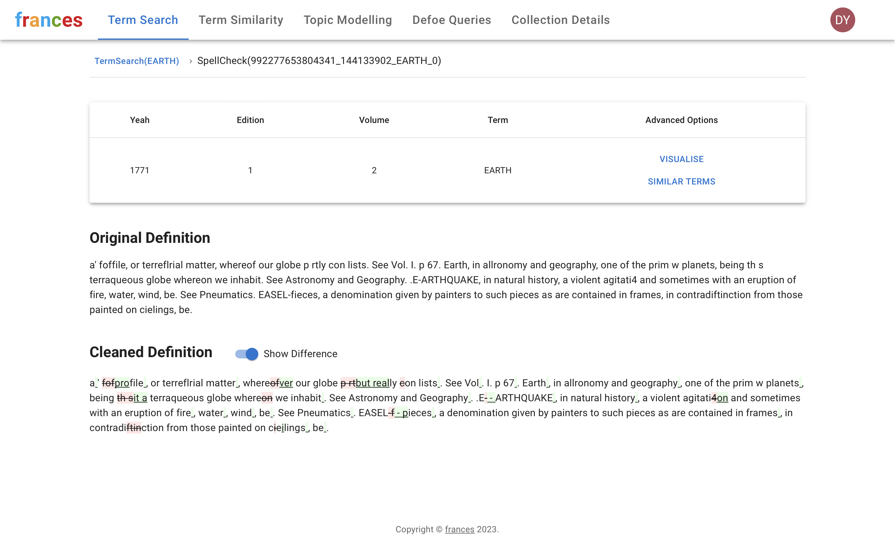
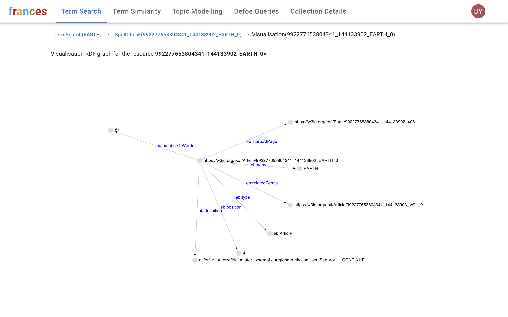

# frances React frontend

## Overview

This is the React frontend for the frances project. 

### Screenshots of the latest UI:

1. Register an account page:

2. Login page:

3. Term Search page:

4. Term Similarity page:

5. Topic Modeling page:

6. Defoe Query Submit page (not accessible until logged in):

7. Defoe Query Result - EB - publication_noralised:

8. Defoe Query Tasks:

9. Defoe Query Result - EB - frequency_keysearch_by_year:

10. Spell Check result for a term search result:

11. Visualise resource in a graph format after spell check:

## Get Started

In the project directory, you can run:

`npm start`